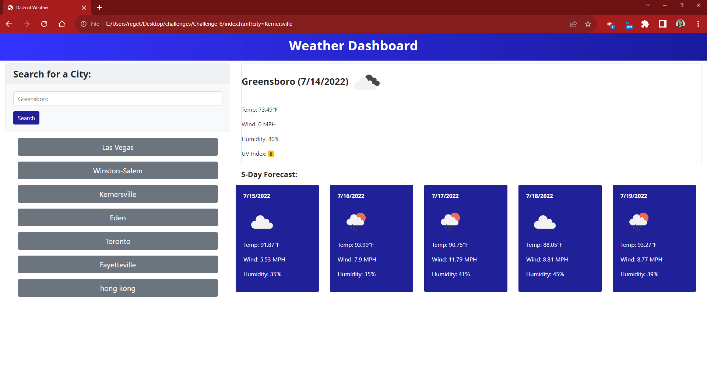

# Dash of Weather

## Description
App that allows a user to enter a location and retrieve a live weather forecast for that place. 

## Screenshot

## Technologies Used
* HTML
* CSS
* JavaScript
* Bootstrap
* OpenWeather One Call API
* OpenWeather Geocoding API

## Deployed Application 
https://rkh1988.github.io/dash-of-weather/

## GitHub Repository
https://github.com/RKH1988/dash-of-weather 